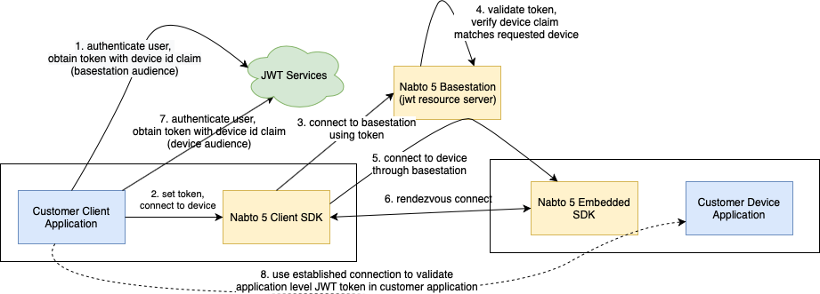

# How to use JWT in Nabto 5

## Overview

Nabto 5 supports JWT tokens directly and indirectly: The Nabto Client SDK directly supports connecting to the basestation using JWT tokens for client authentication. On the device side, there is no direct support for JWT - instead, the general Nabto CoAP implementation can be used to transfer a JWT token to the embedded application which in turn can validate the token.

The two tokens are issued for two different audiences - the basestation audience and the device audience. This distinction prevents the basestation from impersonating a client and connecting to a device. The purpose of the basestation token is merely to prevent DDoS attacks of the target device. Hence, if JWT is used for access control on the device, the second token most be issued also and provided to the device on the established connection.

The flow is outlined in the following figure:

<p align="center">

</p>

In step 8 the end-to-end Nabto connection is established and is in principle ready to use. On this established connection, a Nabto CoAP request containing the JWT as the regular custom payload can be made from the client. The customer application handles the request and validates the token - and the permissions are extracted from the claim and associated with the connection state on the device.

The rendezvous connect indicated in step 6 is not important, it happens asynchronously in the background; until it is established, communication between client and device is still possible, performed on an end-to-end encrypted relay through the basestation.

## Basestation configuration

If enabling JWT authentication support, all JWT fields on the Nabto 5 app settings page for the app in question must be filled out:

* JWT Issuer (`iss`): Standard JWT claim as per the [JWT RFC](https://tools.ietf.org/html/rfc7519). It identifies the principal that issued the JWT and is matched against tokens forwarded by clients.
* JWT Audience (`aud`): Standard JWT claim as per the [JWT RFC](https://tools.ietf.org/html/rfc7519). It identifies the recipients that the JWT is intended for and is matched against tokens forwarded by clients.
* JWT JWKs URI: The URI where the basestation can get the JWKs to validate tokens.
* JWT Nabto IDs claim: The name of the claim in a token in which to find the product ID and device ID that the token grants access to. It could e.g. be `custom:nabtoIds`. The Nabto Basestation extracts the device and product id from this claim at connect requests and rejects the request if the target device does not match these.

## Client configuration

The JWT token is obtained from an arbitrary JWT authorization service and passed on to the basestation as part of the connect sequence using `nabto_client_connection_set_server_jwt_token`:

```
// all error handling omitted

NabtoClient* client = nabto_client_new();
NabtoConnection* connection = nabto_client_connection_new(client);
NabtoClientError ec;

nabto_client_connection_set_server_url(connection, "https://pr-ackywx1n.clients.dev.nabto.net");
nabto_client_connection_set_product_id(connection, "pr-ackywx1n");
nabto_client_connection_set_device_id(connection, "de-wrbpxfm9");
nabto_client_connection_set_private_key(connection, clientPrivateKey);
nabto_client_connection_set_server_api_key(connection, serverKey);

char* token = myapp_obtain_jwt_token();
nabto_client_connection_set_server_jwt_token(connection, token);

NabtoClientFuture* future = nabto_client_future_new(client);
nabto_client_connection_connect(connection, future);
```

## Device configuration

As mentioned above, there is no direct JWT support in the Nabto Embedded SDK. Instead, register a Nabto CoAP handler as per the general CoAP documentation to validate a JWT token as payload.
